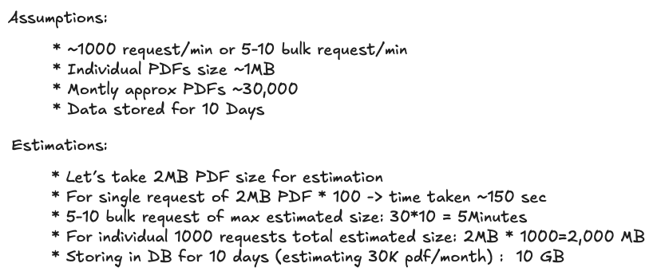
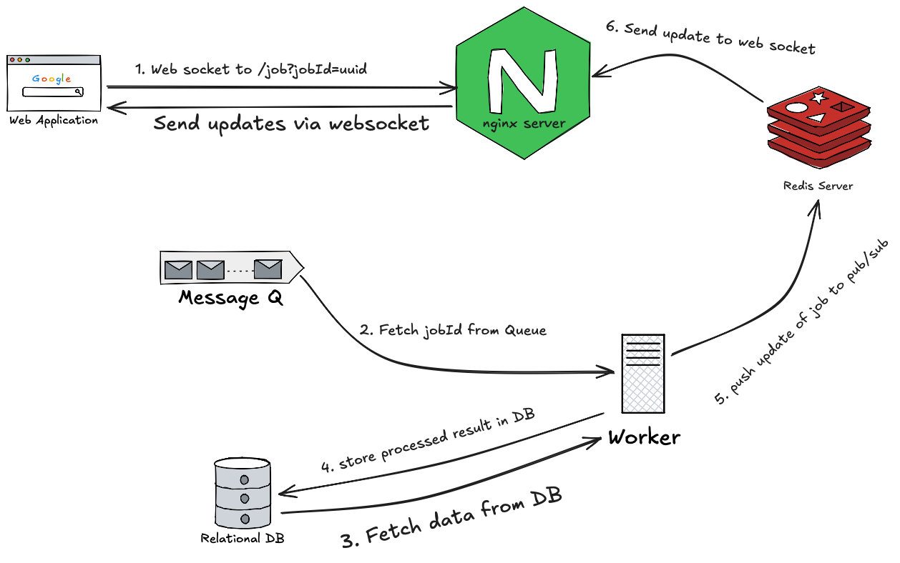

# Approach Document

## Initial Understanding
Q1.  **Before using any AI tools or doing research, what was your initial read of this problem? What did you think the hard parts were?**

The problem was simply to create a program which accepts the JSON payload and template and Generate a PDF from it. 
- I've done this earlier with weasyprint (in Django) but this time I've to do using puppeteer, so problem statement wise not a problem to me.
- For single file response is traditional but for the multiple file response should be a zip, not that complicated can be done easily.
- Single file max size ~1 MB, multi file ~100MB(zipped may reduce it to 50-80)MB
- Concurrent request load was ~1000req/min for single and 5-10 for bulk, this statement seemed tough as most of the part of generation is not owned by the system but by the third party (chromium and puppeteer).
- Existing infra is monolith Django framework, it means we don't have to care about the auth as all of those will be taken care by the primary server itself.
- Variable Document Complexity: This OOM error give me hint to go toward Buffered stream approach and also to go with Golang instead of Django.
- Unreliable Client Connectivity: I won't do direct response as it might make the response hung in case of mulit-pdf , I'll start the process and keep notifying untill done properly.
- Data Consistency: I should not request to DB everytime the worker start creating the PDF as data may get updated, better I'll fetch required data at a point and store it in redis or somewhere else and use it to process all the PDFs. Also somewhere I've to write the time when it was fetch to avoid conflicts later.
- Tamper Evidence: I've to use my keys to sign it somewhere so that similar can't be created witout my keys, or will lookup into LLM for other better options.
- Budget Constraint: I'll prepare based on the conditions and then after doing benchmark I'll think about tackling costs. Seeing budget and monthly uses, based will be to use a small instance of EC2 and schedule the tasks as a queue as for most of the time it will be idle, I'll share the exact calculation later.

## 2. Assumptions & Clarifying Questions
Q. **List any assumptions you made. In a real scenario, what questions would you ask the product team or engineering lead before starting?**
- Will user be able to cancel the job his in between? (It is good to have, for simplicity, I'm removing it for now)
- If a job is not processed yet, and the same user puts new request shall we process it or not? (Assuming he might need data from this snapshot, we should take as a new request)
- Do we remove the PDF or keep it stored in bucket? (here for simplicity I've added it in my db.)

## 3. Capacity Planning & Math
Q. **Show your calculations. How did you arrive at your resource
requirements? Consider: memory, CPU, storage, network bandwidth, queue depth.**

## 4. Design Decisions (minimum 3)

Since there are not much request per month (only 30k), only thing to thought about was handelling the spike (1000req/sec). So I've to go with Message Queue and Worker strategy. I thought with the same strategy but with 3 different languages.

### Decision 1: [Django based]
since the primary service follows django architecture, it will be relatively simpler to add one more app (PDF generator) to it as resource won't be used most of the time so it will help other apps to share the same resources.

- Since using puppeteer, I had to install node and there will be always overhead to maintain this alone service so discarded the plan to go with Django.

### Decision 2: [Golang based]

Handelling spike request, will be favoured most by golang as it will create small goroutines, also it is compiled code so not only it will execute fast it will also consume very less memory. Only concern was it doesn't support puppeteer, alternate was to use chromedp. It should be the best case here but taking puppeteer I dropped the idea.

### Decision 3: [Node.js based]
Using puppeteer it will be the best solution, as puppeteer is js library so no extra service need to run to print pdf. for Queue I've used Redis Pub/Sub and bullmq and stored data in postgres, which can be send to S3 on successfully processed.
#### System design of this approach
- Overall architecture(Along with existing system)

- Sending request with JSON to server

- Sending websocket to accept progress

- Corner Cases(Fault Management)

## 5. AI Usage Log
- https://chatgpt.com/share/69c92150-70f0-8324-a3cf-e58a685323ea
- https://chatgpt.com/share/69cbaa4b-86dc-8320-83ea-3e758dff68c7
- https://chatgpt.com/share/69cbaaae-83a8-8323-bdeb-32a758643280
- https://chatgpt.com/share/69cbaaf2-bb78-8324-bd28-8ef350d39001
## 6. Weaknesses & Future Improvements
I would have implemented the way to create tamper-proof pdfs, and sending the pdfs to S3 bucket also