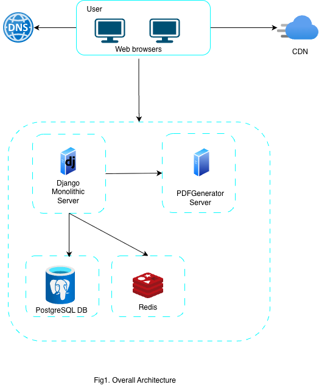

# PDF Generator

This service accepts HTTP requests with JSON payloads and creates PDFs from it.

For single JSON - it returns downloadable PDF.
For multiple JSON it returns zip file of all the pdfs.

## How to build
Change the docker-compose.yaml credentials in the way required or add .env file 

Build and run the service
```shell
docker-compose up
```

Stopping the service
```shell
docker-compose down
```
- Data are stored in volumes, so bringing down the system won't loss any data.
- Migrate will auto run at the time of startup to keep the db updated it will stop once done automatically.

## Walkthrough of the service

### API to send a request to generate PDF.
```shell
# single pdf
curl -X POST http://localhost:3000/job \
  -H "Content-Type: application/json" \
  -d '{
        "title": "User Info",
        "name": "Shubham Kumar",
        "skills": ["Node.js", "Golang"]
      }'
```

```shell
# Multiple pdfs
curl -X POST http://localhost:3000/job \
  -H "Content-Type: application/json" \
  -d '[
        { "name": "A", "age": 25 },
        { "name": "B", "age": 30 }
      ]'

```

### Response from server
```json

{
    'jobId': '30710d35-df3d-41ad-bc7c-d2471e19ff5e'
}
```

### Progress of a job can be followed at
```url
ws://localhost:3000/ws/?jobId=a513909a-b139-4435-b730-8bcfea75a2d1
```
### Response from websocket
```json
{
    "jobId": "a513909a-b139-4435-b730-8bcfea75a2d1",
    "status": "processing",
    "progress": 99
}
```
```json
{
    "jobId": "a513909a-b139-4435-b730-8bcfea75a2d1",
    "status": "completed",
    "downloadUrl": "/download/a513909a-b139-4435-b730-8bcfea75a2d1"
}
```

Once done can be download with the given URL endpoint.

## Structure of overall architecture



## Design of PDF Generator


## Approach and other questions
[click here](./APPROACH.md)